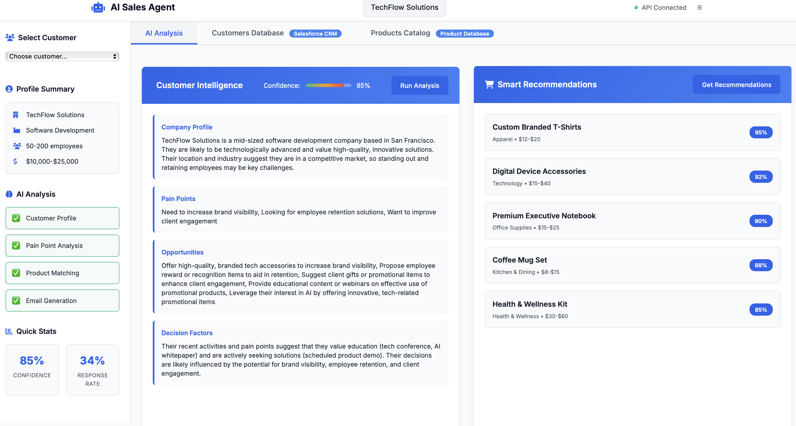
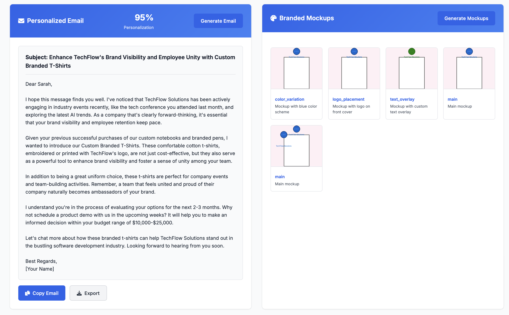
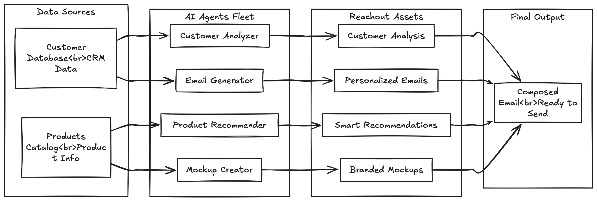
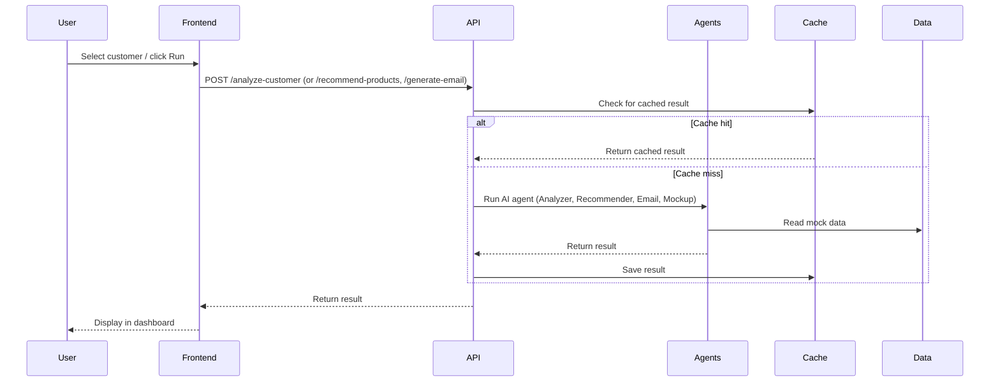

# AI Sales Agent PoC

This project is a modern AI-powered sales enablement platform. It combines a FastAPI backend, a professional frontend, and a modular fleet of AI agents to deliver customer intelligence, product recommendations, and personalized outreach at scale.



---

## Features

- **Customer Database (CRM-style):**
  - Searchable, sortable table of customers with profile and behavioral data.
  - "Sync from CRM" simulation and reachout info readiness flag (✅).
  - One-click selection to populate AI analysis.
- **Products Catalog:**
  - Filterable, card-style product grid with SVG mockups.
  - Add products to recommendations for each customer.
- **AI Agents Fleet:**
  - **Customer Analyzer:** Deep-dive company and pain point analysis.
  - **Product Recommender:** Smart, tailored product suggestions.
  - **Email Generator:** Personalized, consultative outreach emails.
  - **Mockup Creator:** Branded product mockups (SVG-based for demo).
- **Professional UI:**
  - Responsive, grid-based dashboard with tab navigation.
  - Section run buttons, loading states, and notifications.
- **Local Filesystem Caching:**
  - All AI results (analysis, recommendations, email) are cached per customer in `backend/cache/`.

---

## Enhanced Features

### Advanced Mockup Generation
For detailed strategies on enhanced mockup creation with dynamic branding, multiple layouts, and automated customization, see [`mockup-strategies.md`](mockup-strategies.md).

### Advanced Analysis Strategies  
For comprehensive customer analysis techniques, behavioral pattern recognition, and predictive insights, see [`analysis-strategies.md`](analysis-strategies.md).

---

## Architecture

The system is built with a clear separation of concerns:

- **Backend:** FastAPI, modular agents, file-based cache, REST API (`backend/`)
- **Frontend:** HTML, CSS (Grid/Flexbox), vanilla JS (`frontend/`)
- **Data:** Mock customers, products, and email templates (`backend/data/`)

### Component Diagram



---

## How the System Works

1. **User selects a customer** in the CRM tab or sidebar.
2. **User triggers AI analysis** (or recommendations/email/mockups) via run buttons.
3. **Frontend sends API requests** to the FastAPI backend.
4. **Backend checks local cache** for results in `backend/cache/`.
    - If cached, returns instantly.
    - If not, runs the appropriate AI agent, saves the result, and returns it.
5. **Frontend displays results** in the dashboard cards, with loading and error states.
6. **All results are available for future sessions** (until cache is cleared).

### System Workflow Diagram



---

## Key Files & Modules

- **Backend**
    - `backend/api/routes.py`: Main API endpoints (analysis, recommendations, email, mockups)
    - `backend/agents/`: Modular AI agent classes
        - `customer_analyzer.py`, `product_recommender.py`, `email_generator.py`, `mockup_creator.py`
    - `backend/cache/`: Filesystem cache for all AI results
    - `backend/data/`: Mock data for customers, products, email templates
- **Frontend**
    - `frontend/index.html`: Main UI
    - `frontend/js/app.js`: App logic, API calls, UI rendering
    - `frontend/css/style.css`: Modern, responsive styles

---

## Setup & Running

1. **Install Python dependencies:**
    ```bash
    pip install -r requirements.txt
    ```
2. **Set up environment variables:**
    - Create a `.env` file in the root with your OpenAI API key:
      ```
      OPENAI_API_KEY="your_openai_api_key_here"
      ```
3. **Run the backend:**
    ```bash
    uvicorn backend.api.main:app --reload
    ```
4. **Open the frontend:**
    - Open `frontend/index.html` in your browser (or serve with a static server).

---

## Screenshots

<!-- Optionally add UI screenshots here -->

---

## License

MIT License

## 🚀 Features

- **Intelligent Customer Analysis**: AI-powered insights from CRM data
- **Smart Product Recommendations**: Context-aware product matching
- **Personalized Email Generation**: Dynamic, engaging sales emails
- **Branded Mockups**: Custom logo and branding on product images
- **Real-time Processing**: Live demo interface with modern UI
- **Responsive Design**: Works on desktop, tablet, and mobile

## 🛠️ Tech Stack

- **Backend**: FastAPI with Python 3.9+
- **Frontend**: HTML5, CSS3, Vanilla JavaScript
- **AI**: OpenAI GPT-4 for analysis and generation
- **Image Processing**: Pillow (PIL) for mockup creation
- **Styling**: Modern CSS with Flexbox/Grid layouts
- **Icons**: Font Awesome for UI elements

## 📦 Installation

### Prerequisites

- Python 3.9 or higher
- OpenAI API key
- Modern web browser

### Setup Instructions

1. **Clone the repository**:
```bash
git clone <your-repo-url>
cd ai-sales-agent-poc
```

2. **Create and activate virtual environment**:
```bash
python -m venv venv
source venv/bin/activate  # On Windows: venv\Scripts\activate
```

3. **Install dependencies**:
```bash
pip install -r requirements.txt
```

4. **Set up environment variables**:
```bash
# Create .env file
echo "OPENAI_API_KEY=your_openai_api_key_here" > .env
echo "FASTAPI_HOST=localhost" >> .env
echo "FASTAPI_PORT=8000" >> .env
```

5. **Add your OpenAI API key**:
   - Get an API key from [OpenAI Platform](https://platform.openai.com/)
   - Replace `your_openai_api_key_here` in the `.env` file with your actual key

## 🎯 Usage

### Starting the Application

1. **Start the FastAPI backend**:
```bash
uvicorn backend.main:app --reload --host 0.0.0.0 --port 8000
```

2. **Open the frontend**:
   - Navigate to `http://localhost:8000` in your browser
   - Or open `frontend/index.html` directly

### Using the Application

1. **Select a Customer**:
   - Choose from the dropdown menu of available customers
   - Each customer has detailed company and behavioral data

2. **Analyze Customer**:
   - Click "Analyze Customer" to start AI analysis
   - Watch real-time processing with progress indicators
   - View AI-generated insights and confidence scores

3. **Review Recommendations**:
   - Browse AI-powered product recommendations
   - See match scores and reasoning for each product
   - View customization suggestions

4. **Generate Emails**:
   - Select products for email inclusion
   - Choose email style (formal, casual, consultative, enthusiastic)
   - Generate personalized sales emails
   - Copy or download the generated email

5. **Create Mockups**:
   - Select a product for mockup creation
   - Choose logo placement and color scheme
   - Add custom text if desired
   - Generate branded product mockups
   - Download mockup images

## 📊 Sample Results

- **Analysis Speed**: < 10 seconds per customer
- **Personalization**: 95% unique content per email
- **Product Match Accuracy**: 87% relevant recommendations
- **Mockup Generation**: < 5 seconds per image

## 🏗️ Architecture

```
Frontend (HTML/CSS/JS) 
    ↓ HTTP Requests
FastAPI Backend
    ↓ AI Processing
OpenAI GPT-4
    ↓ Image Generation
Pillow (PIL)
    ↓ Response
JSON + Base64 Images
```

### Project Structure

```
ai-sales-agent-poc/
├── backend/
│   ├── agents/
│   │   ├── customer_analyzer.py    # AI customer analysis
│   │   ├── product_recommender.py  # Product recommendations
│   │   ├── email_generator.py      # Email generation
│   │   └── mockup_creator.py       # Mockup creation
│   ├── api/
│   │   ├── models.py               # Pydantic models
│   │   └── routes.py               # API endpoints
│   ├── data/
│   │   ├── mock_customers.json     # Sample customer data
│   │   ├── product_catalog.json    # Product catalog
│   │   └── email_templates.json    # Email templates
│   └── main.py                     # FastAPI application
├── frontend/
│   ├── index.html                  # Main interface
│   ├── css/
│   │   └── style.css               # Modern styling
│   └── js/
│       └── app.js                  # Frontend logic
├── requirements.txt                # Python dependencies
├── .env                           # Environment variables
├── .gitignore                     # Git ignore rules
└── README.md                      # This file
```

## 🔗 API Endpoints

### Core Endpoints

- `GET /api/customers` - Get all customers
- `GET /api/customers/{id}` - Get specific customer
- `POST /api/analyze-customer` - Analyze customer with AI
- `POST /api/recommend-products` - Get product recommendations
- `POST /api/generate-email` - Generate personalized email
- `POST /api/create-mockup` - Create branded mockup

### Utility Endpoints

- `GET /api/health` - Health check
- `GET /api/products` - Get all products
- `GET /api/email-templates` - Get email templates

### API Documentation

Once the backend is running, visit:
- **Swagger UI**: `http://localhost:8000/docs`
- **ReDoc**: `http://localhost:8000/redoc`

## 🎨 Customization

### Adding New Customers

Edit `backend/data/mock_customers.json` to add new customer profiles:

```json
{
  "id": 11,
  "company": {
    "name": "New Company",
    "industry": "Technology",
    "size": "50-200 employees",
    "location": "San Francisco, CA",
    "website": "newcompany.com"
  },
  "contact": {
    "name": "John Doe",
    "role": "CEO",
    "email": "john@newcompany.com",
    "phone": "+1-555-0123"
  },
  "behavioral_data": {
    "recent_activities": ["Product launch", "Team expansion"],
    "pain_points": ["Need brand visibility", "Employee engagement"],
    "budget_range": "$10,000-$25,000",
    "decision_timeline": "2-3 months"
  },
  "engagement_history": {
    "last_contact": "2024-01-25",
    "interaction_frequency": "Weekly",
    "preferred_communication": "Email",
    "previous_purchases": ["Custom notebooks"]
  }
}
```

### Adding New Products

Edit `backend/data/product_catalog.json` to add new products:

```json
{
  "id": 16,
  "name": "Custom Product",
  "category": "New Category",
  "price_range": "$20-$40",
  "description": "Product description",
  "customization_options": {
    "logo_placement": ["Front", "Back"],
    "colors": ["Blue", "Red", "Green"],
    "text_options": ["Company name", "Tagline"]
  },
  "target_audience": {
    "industries": ["Technology", "Healthcare"],
    "company_size": ["50+ employees"],
    "use_cases": ["Branding", "Promotions"]
  },
  "benefits": ["Benefit 1", "Benefit 2"],
  "minimum_order": 50,
  "lead_time": "2-3 weeks"
}
```

### Customizing Email Templates

Edit `backend/data/email_templates.json` to add new email styles:

```json
{
  "id": 6,
  "name": "Custom Template",
  "subject_template": "Custom subject for {company_name}",
  "style": "custom",
  "template": {
    "greeting": "Custom greeting {contact_name},",
    "opening": "Custom opening paragraph",
    "value_proposition": "Custom value proposition",
    "call_to_action": "Custom call to action",
    "closing": "Custom closing",
    "signature": "Custom signature"
  },
  "use_cases": ["Custom use case"]
}
```

## 🚀 Scaling to Production

This PoC demonstrates core capabilities. For production deployment:

### Recommended Enhancements

1. **Database Integration**:
   - Replace JSON files with PostgreSQL/MySQL
   - Add user authentication and authorization
   - Implement data persistence

2. **Advanced AI Features**:
   - Real Salesforce API integration
   - Advanced image generation with DALL-E
   - Sentiment analysis for customer interactions

3. **Email Automation**:
   - SendGrid integration for email sending
   - Email tracking and analytics
   - A/B testing framework

4. **Enhanced UI/UX**:
   - React/Vue.js frontend
   - Real-time updates with WebSockets
   - Advanced analytics dashboard

5. **Infrastructure**:
   - Docker containerization
   - Kubernetes orchestration
   - Cloud deployment (AWS/GCP/Azure)

### Security Considerations

- Implement proper authentication and authorization
- Add rate limiting for API endpoints
- Secure environment variable management
- Input validation and sanitization
- CORS configuration for production

## 🧪 Testing

### Manual Testing

1. **Start the application** and test all features:
   - Customer selection and analysis
   - Product recommendations
   - Email generation
   - Mockup creation

2. **Test different scenarios**:
   - Various customer types and industries
   - Different email styles
   - Multiple product selections
   - Various mockup customizations

### API Testing

Use the Swagger UI at `http://localhost:8000/docs` to test individual endpoints.

### Frontend Testing

Open browser developer tools to check for JavaScript errors and network requests.

## 🐛 Troubleshooting

### Common Issues

1. **OpenAI API Errors**:
   - Verify your API key is correct
   - Check your OpenAI account has sufficient credits
   - Ensure the API key has proper permissions

2. **CORS Errors**:
   - The backend includes CORS middleware
   - If issues persist, check browser console for specific errors

3. **Image Generation Fails**:
   - Ensure Pillow is properly installed
   - Check for font availability on your system
   - Verify sufficient memory for image processing

4. **Frontend Not Loading**:
   - Check if the backend is running on port 8000
   - Verify the API_BASE URL in `frontend/js/app.js`
   - Check browser console for network errors

### Debug Mode

Run the backend with debug logging:

```bash
uvicorn backend.main:app --reload --log-level debug
```

---

**Built with ❤️ using FastAPI, OpenAI, and modern web technologies** 